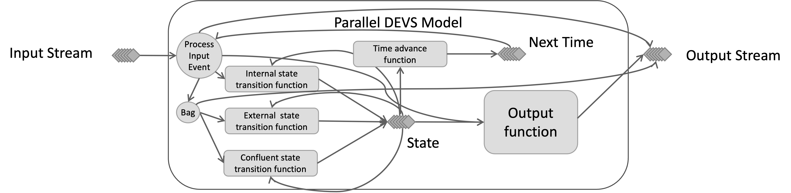

# DEVS Streaming Framework (DEVS-SF) Overview

## Systems and Their Models

A system is a black box.  It transforms a stream of inputs to a stream of outputs.

DEVS models a system as seen below.  If we know the current state, and the stream of inputs at a specific time, the state transition function determines the next state.  The output function determines the output from the current state.

DEV-SF uses a parallel DEVS model as its implementation of a system model.  It interacts with external systems via messages, which leads to distributed, loosely coupled models.  Each input type (Sensor location, target location, sensor command) comes in through the input stream.  Control events (initialize, send output, execute transition, time) also come in through the input stream.  An event processor reads events from the input stream, processes them, and sends events to another set of streams.  It breaks state transition function into 3 cases:
* Internal state transition executes next internal event.
* External state transition based on receipt of inputs prior to next internal event.
* Confluent transition function executed when inputs are received as same time as next internal event.

It also adds time advance function to schedule next internal event for a model

Just as sub-systems can be coupled together via interfaces, system models are coupled by routing the outputs of models to the inputs of other models.

However, when viewed as a black box, a coupled system model behaves exactly as a system model.  More formally, DEVS models are *closed under coupling* because any network of coupled system models is itself a system model.  

This property enables the hierarchical construction of system models to potentially mirror the hierarchical structure of real systems, sub-systems, and components.

DEVS-SF implements coupled models as a Parallel DEVS Coordinator.  With the same interface as a Parallel DEVS Model, it routes input/output streams to the influenced models through Parallel DEVS Couplings.  By managing time and execution of subordinate models, it yields discrete event model that allows stream of inputs, outputs and state to be computed for models in the structure.

## Example Sensor Network Models

As an example of the type of model hierarchy that suitable for DEVS modeling, consider a network of sensor models arrayed on a combat vehicle to detect threats on the battlefield.  This sensor network can be modeled abstractly with a simple probability of detection.  When a threat approaches, the output is a detection or non-detection based on a random draw.  

However, the system is composed of several individual sensors, we will call sub-systems.  Each sensor can be modeled in a little more detail with a detection range and detection probability.  DEVS handles this by decomposing the network of sensor models into a set of coupled models as seen below.

Finally, one of the sensors can be modeled by a set of sensor components, the lens, the detector array, and the display.  The models of each of these components are coupled together.  A hierarchical depictions of these models is shown below.

