# DEVS Streaming Framework - *Protocol for Composing Distributed DEVS Models Across Different Simulation Frameworks*


## Introduction

The Discrete Event System Specification Streaming Framework (DEVS-SF) is
a data exchange specification that allows composition of DEVS models
running on different computers, potentially built with different DEVS
frameworks, into a single simulation run. It is a JSON data
specification developed for exchange over commercially available
streaming platforms, such as Apache Kafka, so simulation architectures
can be built using open-source technologies. The use of the DEVS-SF by
an existing DEVS implementation requires the development of a DEVS
simulator to consume DEVS-SF messages from an event stream, execute its
associated atomic or coupled model, and publish events back to an event
stream. DEVS-SF also enables the development of DEVS wrappers around
non-modular simulation architectures, such as High Level Architecture
(HLA) of the US Army's Bifrost[[1]](#ref1) server, so they may execute as models
in a DEVS simulation. This Java implementation of DEVS-SF
is available as open-source software, licensed under the Apache license.
Work is ongoing to build a C++
implementation to work with adevs[[2]](#ref2).  

## Systems and Their Models

The purpose of this section is to summarize graphically the high points
of the mathematical formulations of the DEVS framework. For a thorough
understanding of the DEVS framework, its formulation, and its relevance
across simulation paradigms, we refer the reader to the latest editions
of Theory of Modeling and Simulation[[3]](#ref3) and Guide to Modeling and
Simulation of Systems of Systems.[[4]](#ref4) However, these mathematical
formulations take some time to digest, and this can be a barrier to
adoption or even a barrier to trust in DEVS as a simulation modeling
approach. The contents in this section have been used in several
settings to introduce simulation practitioner to DEVS modeling in order
to help overcome some of these barriers.

A system can be viewed as a black box. It transforms a stream of inputs
to a stream of outputs.


*Figure 1.  A system.*

DEVS models a system as seen in Figure 2. If we know the current state,
and the stream of inputs at a specific time, the state transition
function determines the next state. The output function determines the
output from the current state.

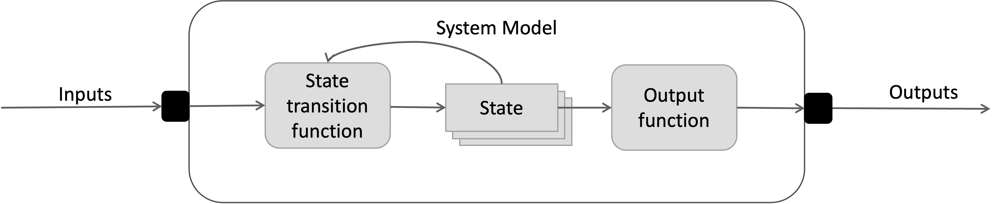

*Figure 2.  A system model.*


DEV-SF uses a parallel DEVS model as its implementation of a system
model, as seen in Figure 3. It interacts with external systems via
messages, which leads to distributed, loosely coupled models. Each input
type (Sensor location, target location, sensor command) comes in through
the input stream. Control events (initialize, send output, execute
transition, time) also come in through the input stream. An event
processor reads events from the input stream, processes them, and sends
events to another set of streams. It breaks state transition function
into 3 cases:

-   Internal state transition executes next internal event.

-   External state transition based on receipt of inputs prior to next
    internal event.

-   Confluent transition function executed when inputs are received as
    same time as next internal event.

It also adds time advance function to schedule next internal event for a
model.

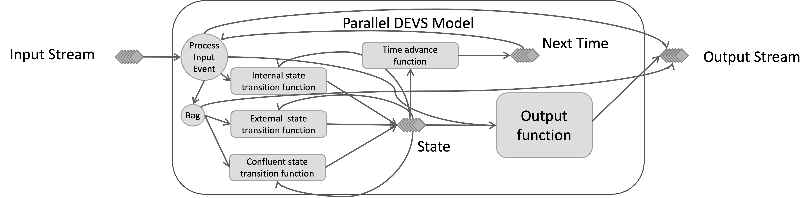

*Figure 3.  A parallel DEVS model.*


Just as sub-systems can be coupled together via interfaces, system
models are coupled by routing the outputs of models to the inputs of
other models, as seen in Figure 4.


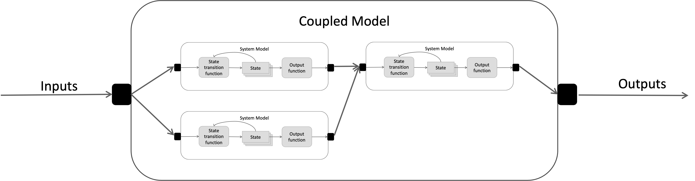

*Figure 4.  A coupled model.*


However, when viewed as a black box, a coupled system model behaves
exactly as a system model. More formally, DEVS models are *closed under
coupling*[[5]](#ref5) because any network of coupled system models is itself a
system model, as shown in Figure 5.

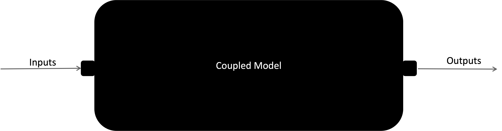

*Figure 5.  A coupled model viewed as a black box.*


This property enables the hierarchical construction of system models to
potentially mirror the hierarchical structure of real systems,
sub-systems, and components as shown in Figure 6.

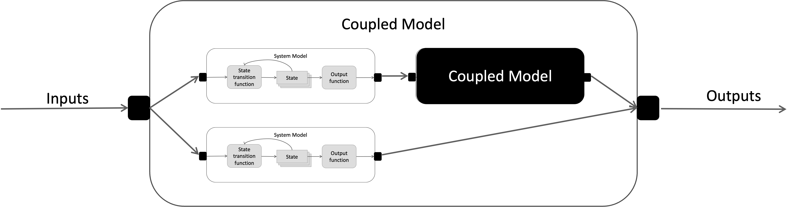

*Figure 7.  A hierarchy of coupled system models.*


DEVS-SF implements coupled models as a Parallel DEVS Coordinator. With
the same interface as a Parallel DEVS Model, it routes input/output
streams to the influenced models through Parallel DEVS Couplings. By
managing time and execution of subordinate models, it yields discrete
event model that allows stream of inputs, outputs and state to be
computed for models in the structure, as seen in Figure 7.

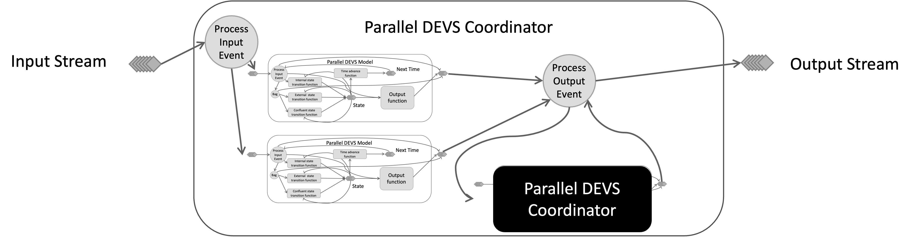

*Figure 8.  A hierarchy of coupled parallel DEVS coupled models.*


### Example Sensor Network Models

As an example of the type of model hierarchy that suitable for DEVS
modeling, consider a network of sensor models arrayed on a combat
vehicle to detect threats on the battlefield. This sensor network can be
modeled abstractly with a simple probability of detection. When a threat
approaches, the output is a detection or non-detection based on a
random draw.

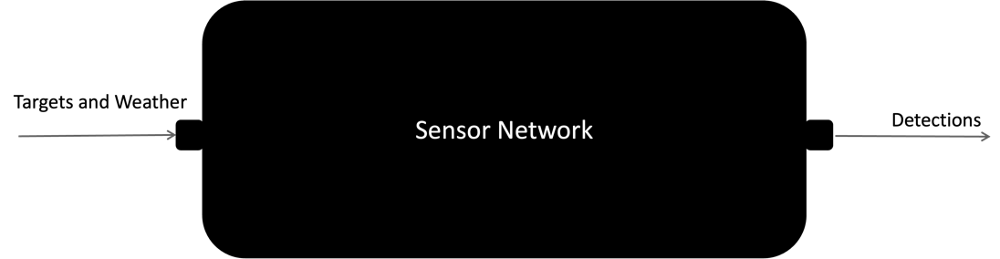

*Figure 9.  A sensor network as a single model.*

However, the system is composed of several individual sensors, we will
call sub-systems. Each sensor can be modeled in a little more detail
with a detection range and detection probability. DEVS handles this by
decomposing the network of sensor models into a set of coupled models as
seen below.

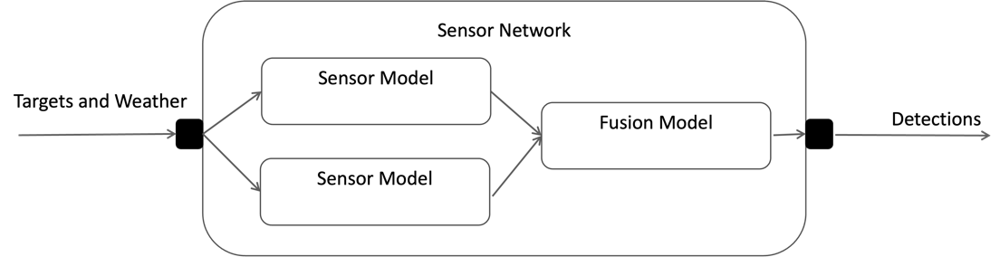

*Figure 10.  A sensor network modeled by coupled sensor models.*


Finally, one of the sensors can be modeled by a set of sensor
components, the lens, the detector array, and the display. The models of
each of these components are coupled together. A hierarchical depiction
of these models is shown below.

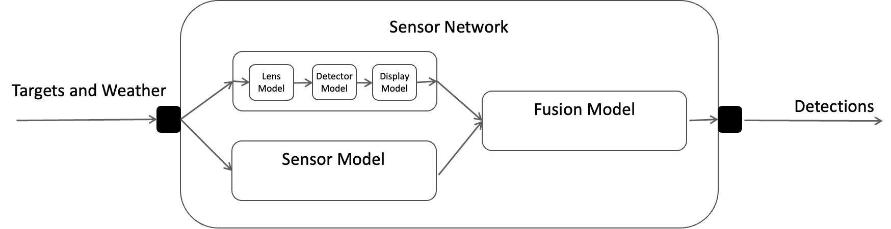

*Figure 11.  A full hierarchy of models in a sensor network.*

## Non-Modular Models

Non-modular models are models that, unlike DEVS models, allow other
models to access their internal state. For example, in Figure 11, model
B has direct read access to model A during its state transition
function. Model B also has direct write access to the state of model C.
This type of global state access is common in simulation
implementations.

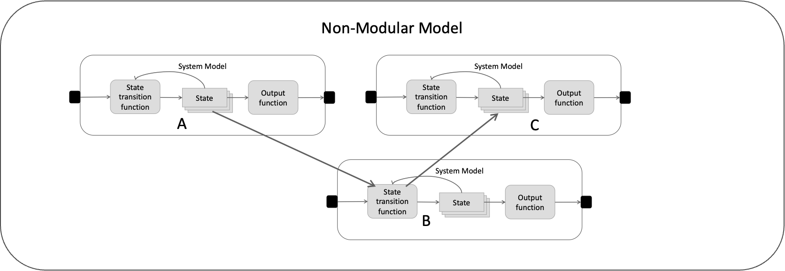

*Figure 11.  Non-modular models.*

Standardized simulation protocols typically implement their components
as non-modular models with a global state sharing mechanism, as shown in
Figure 12. This is true for the published SISO standards, High Level
Architecture (HLA) and Web Live, Virtual, Constructive (WebLVC). It is
also true US Army's Bifrost technology. Another characteristic of
distributed simulation standards is to synchronize time via real time,
also known as "wall-clock" synchronization. In this paradigm, there is
no synchronized global event list, and each model executes events once
the real-time clock allows them. This is true for Distributed
Interactive Simulation, WebLVC, and Bifrost.

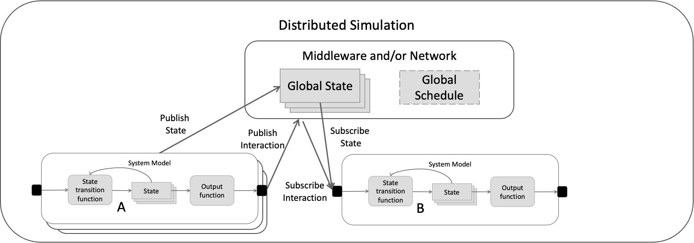

*Figure 11.  Non-modular distributed simulation protocols.*

DEVS-SF enables the interoperation of DEVS models with non-modular
simulation architectures via the universality and uniqueness of DEVS
models.[[6]](#ref6) In short, if the non-modular model is a set of functions to
produce time-based output streams from time-based input streams, then
there is a way to construct an equivalent DEVS model for that
non-modular model. DEVS-SF constructs equivalent DEVS models via DEVS
wrappers for existing non-modular protocols. Once this is done, they can
be executed by a Parallel DEVS Coordinator as if they were Parallel DEVS
models, as shown in Figure 13, with a wrapped non-modular WebLVC model.
The non-modular system model A publishes its state to the DEVS/WebLVC
wrapper. The Parallel DEVS Coordinator then couples model A's output
with the input of Parallel DEVS Model B.

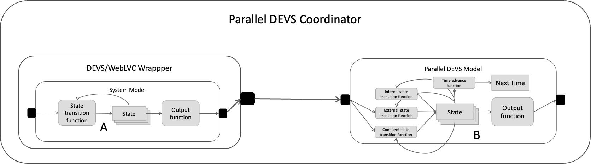

*Figure 12.  DEVS wrapper for WebLVC protocol.*

The DEVS community has shown success in leveraging the universality and
uniqueness of DEVS to interoperate with HLA, WebLVC, and Bifrost. The
integration with Bifrost is explicitly done via DEVS-SF. This opens the desired
possibility of using DEVS as a universal simulator for a hierarchy of
other models in a multi-architecture federation, as shown in Figure 14.

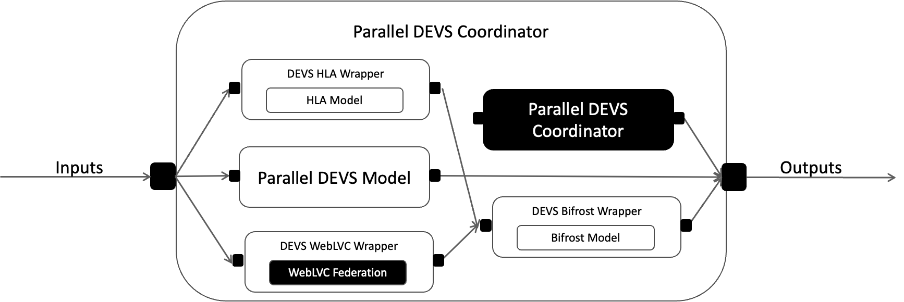

*Figure 13. Desired capability for DEVS execution of a multi-architecture
hierarchy of models.*


## DEVS-SF Example Multi-Architecture Scenario

Consider an example use case working with a defense customer. The
customer would like to evaluate the effectiveness of deploying a new
sensor and a new artillery fires system in a contested cyber scenario.
The scenario of interest is already modeled in an HLA federation. In
addition, the customer has access to a federation of cyber models, in a
non-standard and non-modular architecture, that represents the contested
cyber domain. Finally, the customer has their own models of the new
sensor and new artillery fires system. In their initial implementation,
the customer ran each model independently and manually configured the
outputs of one model to be processed by the inputs of the next model, as
illustrated in Figure 15. This implementation did work for Monte Carlo
run sets, but it was slow and tedious, limiting flexibility in the
design of experiments.

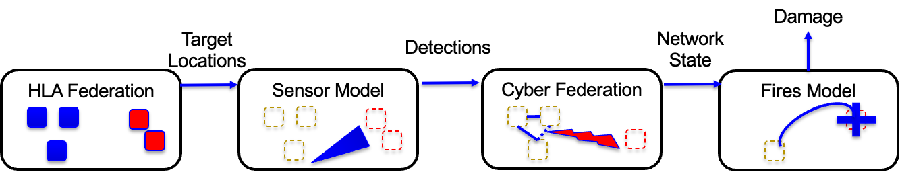

*Figure 14.  Example analysis scenario.*

Consider a proposed DEVS-SF implementation, shown in Figure 16, where
DEVS simulators and DEVS wrappers are built for the existing models to
synchronize time-managed execution of the entire system in a DEVS
simulation. To implement this architecture, the customer would have to
build Parallel DEVS Simulators to wrap the Sensor Model and Fires Model.
They would also have to build DEVS wrappers for the HLA Federation and
the Cyber Federation.

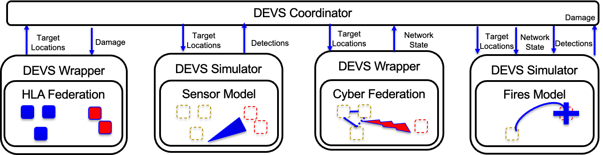

*Figure 15.  DEVS multi-architecture implementation of analysis scenario.*

Figure 16 shows the necessary steps for the customer to build the DEVS
Simulator around the existing Sensor Model. The same process would be
applied for the existing Fires Model. They must implement the necessary
functions necessary to manipulate internal state based on the advance of
time and the target location events arriving as input streams. Based on
the internal state, they would have to define functions to advance time
and generate output. If their model is in Java or C++, the existing
DEV-SF library in one of those languages facilitates development of the
DEVS Simulator and interface with the streaming platform.

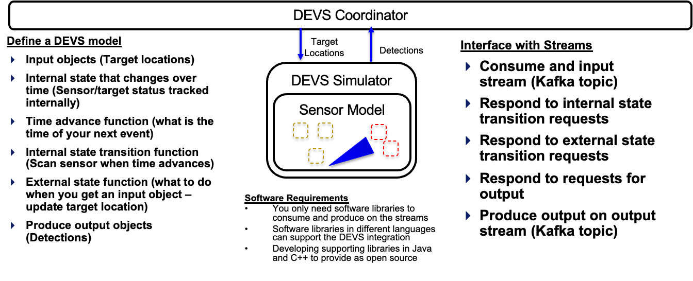

*Figure 16.  Steps to implement a DEVS simulator.*

Figure 17 shows the necessary steps for the customer to build a DEVS
Coordinator that couples the subordinate models in a single execution.
They must implement couplings that transform the outputs of each model
and route them to the corresponding inputs of other models. For example,
detections are routed from the output of the Sensor Model to the input
of the Fires Model. Again, the existing DEVS-SF libraries can be used to
support development of a coordinator with these couplings that also
routes inputs and outputs to the corresponding streams.


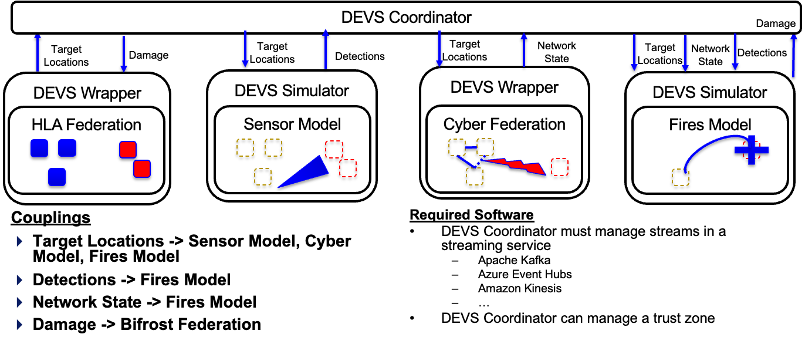

*Figure 17.  Steps to implement a DEVS coordinator.*

Finally, to execute their design of experiments, the customer could
implement a DEVS Experimental Frame, as shown in Figure 18, to generate
input for each run and accept outputs. Its acceptor supports online
model verification and validation (V&V) while its transducer computes
system evaluation measures of effectiveness from the simulation outputs.

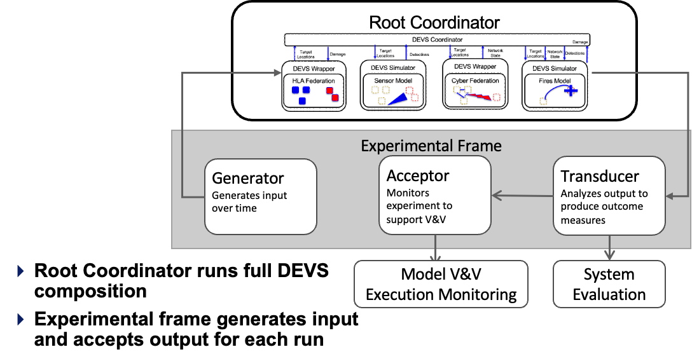

*Figure 18.  Experimental frame to coordinate experimental runs.*

This motivating example shows a generalizable use case where a customer
requires a synchronized run of disparate models in disparate
architectures to support systems analysis. DEVS-SF provides an
architecture and software support to implement synchronization via DEVS
modeling. Once build, it allows the customer to efficiently monitor and
run an experimental design of choice.

## DEVS-SF Implementation

The parallel DEVS implementation has the following top-level components:

-   **PDevsModel.java**

    -   Internal state class and time type are type parameters

    -   Input classes are type parameters of input ports

    -   Abstract member functions for internal, external, and confluent
        state transitions, output function, and time advance function

    -   Output classes are type parameters of output ports

-   **PDevsSimulator.java**

    -   Time, PDevsModel concrete type, and internal state type are type
        parameters

    -   An akka.io actor that responds to DEVS Streaming Framework
        messages, executes appropriate functions on PDevsModel, and
        sends response values to its parent PDevsCoordinator

-   **PDevsCoordinator.java**

    -   Time type is a type parameter

    -   An akka.io actor that responds to DEVS Streaming Framework
        messages, routes messages to subordinate PDevsModels, collects
        their output, and routes according to couplings

    -   PDevsCouplings defines routing and transformation of input
        messages from parent and output messages from subordinate models

    -   Subordinates can be either a PDevsSimulator or a
        PDevsCoordinator according to DEVS closure under coupling

-   **RootCoordinator.java**

    -   Executes the DEVS hierarchy from initialization until time
        reaches stop criterion

-   **Apache Kafka Streaming**

    -   Must use only one partition per topic to guarantee message order
        in an asynchronous request-response fashion

    -   KafkaDevsStreamProxy.java serves as a proxy subordinate model,
        routing messages to a Kafka topic

    -   KafkaReceiver.java pulls messages from a Kafka topic and routes
        them to a distributed simulator


# Sample DEVS-SF Distributed Federation

In order to demonstrate interoperability via DEVS-SF between two
different DEVS frameworks, consider this sample DEVS-SF
distributed federation using its own open source Java implementation and
the in-development C++ implementation that works with Adevs. The Busy
Mart store is a simple single server queue, a Clerk, that receives input
from a customer arrivals process, the Generator, and passes output data
to an Observer. The example, shown in ???, is derived from the Busy Mart
store example in the adevs documentation.[[7]](#ref7) In this implementation,
the Clerk model from the Adevs example is executed by a DEVS-SF
simulator that pulls its input stream from and Apache Kafka "clerk1"
topic and publishes its output stream to a "storeCoordinator" topic. The
rest of the simulation is implemented in Java, where the Store
Coordinator, a DevsSfCoordinator, implements a Generator and Observer as
a PDevsModel executed by a PDevsSimulator. However, the Java framework
replaces a Clerk simulator with a proxy model that publishes its input
stream to the "clerk1" topic and consumes output destined for the
StoreCoordinator from the "storeCoordinator" topic.


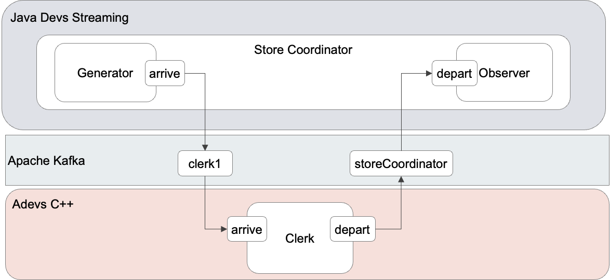

*Figure 19.  Example Busy Mart DEVS-SF Distributed Federation*


The clerks state is the queue of customers, each with an associated wait
time. Its initial state is empty.

At time 0, the Clerk Simulator receives the following InitSim message
that sets the initial time for the simulation.

```json
{
  "devsType": "devs.msg.InitSim",
  "time": {
    "timeType": "devs.msg.time.DoubleSimTime",
    "t": 0
  }
}

```

**Clerk 1: Time = 0, Next Time = Infinity, Queue: Empty**

So Clerk 1 responds with the following NextTime message to inform the
StoreCoordinator of its time advance function in its initial state.

```json
{
  "devsType": "devs.msg.NextTime",
  "time": {
    "timeType": "devs.msg.time.DoubleSimTime",
    "t": "1.7976931348623157E308"
  },
  "sender": "clerk1"
}

```

At time 1, the Generator outputs a customer with a service time of 1,
which is routed to the Clerk Simulator with the following
ExecuteTransition message, which causes Clerk 1 to execute its external
state transition. The customer is added to the queue, and its next
transition will be at time = 2 when this first customer has finished
checking out.

```json
{
  "devsType": "devs.msg.ExecuteTransition",
  "modelInputsOption": {
    "portValueList": [{
        "value": {"twait": 1,"tenter": 1,"tleave": 0},
        "portIdentifier": "arrive",
        "portType": "cloud.simlytics.devssfstore.Customer"
      }]
  },
  "time": {
    "timeType": "devs.msg.time.DoubleSimTime","t": 1
  }
}

```

**Clerk 1: Time = 1, Next Time = 2, Queue: Customer 1, Service time =
1**

The StoreSimulator responds with the following TransitionDone message to
inform the StoreCoordinator that it has completed state transition and
the result of its time advance in this new state is 2.

```json
{
  "devsType": "devs.msg.TransitionDone",
  "time": {
    "timeType": "devs.msg.time.DoubleSimTime",
    "t": 1
  },
  "nextTime": {
    "timeType": "devs.msg.time.DoubleSimTime",
    "t": 2
  },
  "sender": "clerk1"
}

```

At time = 2, Clerk 1 is an imminent model, so the StoreCoordinator
directs it to send output using the SendOutput message below,

```json
{
  "devsType": "devs.msg.SendOutput",
  "time": {
    "timeType": "devs.msg.time.DoubleSimTime",
    "t": 2
  }
}

```

The ClerkSimulator executes Clerk 1's output function and returns the
following ModelOutputMessage.

```json
{
  "devsType": "devs.msg.ModelOutputMessage",
  "time": {
    "timeType": "devs.msg.time.DoubleSimTime","t": 2
  },
  "nextTime": {
    "timeType": "devs.msg.time.DoubleSimTime","t": 2
  },
  "modelOutput": {
    "portValueList": [{
        "portIdentifier": "depart",
        "portType": "cloud.simlytics.devssfstore.Customer",
        "value": {"twait": 1,"tenter": 1,"tleave": 2}
      }]
  },
  "sender": "clerk1"
}

```

Also at t = 2, the generator produced a customer arrival, Customer 2
with a service time of 4. The StoreCoordinator routes this arrival to
Clerk 1 and directs a confluent state transition with the following
ExecuteTransition message. Because this message provides input, a
customer, at the same time as Clerk 1's next internal transition, it
results in a confluent transition function. The clerk first removes
Customer 1 from the service queue and then adds Customer 2, with a
service time of 4, to the queue. Based on this internal state, the
result of its time advance function is 6, when Customer 4 is scheduled
to depart.

```json
{
  "devsType": "devs.msg.ExecuteTransition",
  "modelInputsOption": {
    "portValueList": [{
        "value": {"twait": 4,"tenter": 2,"tleave": 0},
        "portIdentifier": "arrive",
        "portType": "cloud.simlytics.devssfstore.Customer"
      }]
  },
  "time": {
    "timeType": "devs.msg.time.DoubleSimTime","t": 2
  }
}

```

**Clerk 1: Time = 2, Next Time = 6, Queue: Customer 2, Service time =
4**

Clerk 1 sends the following TransitionDone message to the
StoreCoordinator to let it know that it has completed state transition
and that its next scheduled internal transition is at time = 6.

```json
{
  "devsType": "devs.msg.TransitionDone",
  "time": {
    "timeType": "devs.msg.time.DoubleSimTime",
    "t": 2
  },
  "nextTime": {
    "timeType": "devs.msg.time.DoubleSimTime",
    "t": 6
  },
  "sender": "clerk1"
}

```

At time = 6, the Store Coordinator directs Clerk 1 to execute an
internal transition with the ExecuteTransition message below. Note that
the message has no model inputs, so it results in an internal state
transition. Upon receipt, Clerk 1 executes its internal state transition
which causes Customer 2 to depart, leaving and empty queue. Therefore,
the time advance function results in no scheduled future events, or t =
Infinity.

```json
{
  "devsType": "devs.msg.ExecuteTransition",
  "modelInputsOption": null,
  "time": {
    "timeType": "devs.msg.time.DoubleSimTime",
    "t": 6
  }
}

```

**Clerk 1: Time = 6, Next Time = Infinity, Queue: Empty**

Clerk 1 responds with the following TransitionDone message:

```json
{
  "devsType": "devs.msg.TransitionDone",
  "time": {
    "timeType": "devs.msg.time.DoubleSimTime",
    "t": 6
  },
  "nextTime": {
    "timeType": "devs.msg.time.DoubleSimTime",
    "t": "1.7976931348623157E308"
  },
  "sender": "clerk1"
}

```

At this point, the Generator has no more customer arrivals, so there are
no more events. It is time to end the simulation run. To coordinate shut
down, the StoreCoordinator sends the following SimulationDone message to
Clerk 1.

```json
{
  "devsType": "devs.msg.SimulationDone",
  "time": {
    "timeType": "devs.msg.time.DoubleSimTime",
    "t": 6
  }
}
```

There are some additional notable characteristics for the JSON messages
exchanged between the Java components and the C++ components in Adevs.
First, each message is tagged with a "devsType" field that is based on
the Jackson serialization framework -- Java implementation. However, the
C++ serialization framework also uses these same tags to identify the
type of each message. Additionally, the messages use a "timeType" of
"devs.msg.time.DoubleSimTime." This implements simulation time as a
double precisioin value. The meaning of one unit is left up to the
implementing models. In this case it is one minute. DEVS-SF also
implements a "devs.msg.time.LongSimTime" to implement time as Long
Integer values. Other implementations of time are possible, but not
currently provided for use.


<a name="ref1">[1]: US Army Program Executive Office -- Simulation, Training, and
    Instrumentation (PEO-STRI), One Semi-Automated Forces (OneSAF),
    available at <https://www.peostri.army.mil/onesaf>.</a>


<a name="ref2">[2]: Nutaro, Jim, A Discrete Event system Simulator, Oak Ridge National
    Labs, available at
    <https://web.ornl.gov/~nutarojj/adevs/docs/manual/manual.html></a>

<a name="ref3">[3]: Zeigler, Bernard P., Muzy, Alexandre, and Kofman, Ernesto, Theory
    of Modeling and Simulation: Discrete Event & Iterative Systems
    Computational Foundations, Third Edition, Elsevier, 2019, available
    at
    <https://shop.elsevier.com/books/theory-of-modeling-and-simulation/zeigler/978-0-12-813370-5>.</a>

<a name="ref4">[4]: Zeigler, Bernard P. and Sarjoughian, Hessam S., Guide to Modeling
    and Simulation of Systems of Systems, Second Edition, Springer,
    2017, available at
    <https://link.springer.com/book/10.1007/978-3-319-64134-8>.</a>

<a name="ref5">[5]: Theory of Modeling and Simulation, section 5.8.</a>

<a name="ref6">[6]: Theory of Modeling and Simulation, section 18.2.</a>

<a name="ref7">[7]: Nutaro, Jim, Modeling and simulation with Adevs, available at
    <https://web.ornl.gov/~nutarojj/adevs/docs/manual/node4.html>.</a>
